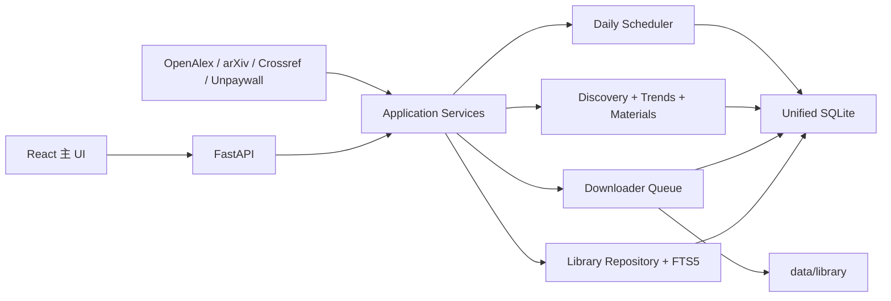

# Target Architecture

## 架构决定

唯一主程序是现有 `condmat-trend-radar`。不创建第三个项目，不引入微服务、消息队列集群、Docker 或 Elasticsearch。FastAPI、React、SQLite 和 Windows 本地脚本继续作为主技术栈。

`lab_paper_intake` 暂时保留为只读 legacy source 和回归参照；经过能力等价验证后，正常启动流程不再启动 Streamlit，但旧目录、数据库、PDF、导出和发布包不删除。

## 目标代码布局

为避免高风险整体改名，保留仓库目录 `condmat-trend-radar`，在其内部形成清晰边界：

```text
condmat-trend-radar/
├── backend/
│   ├── api/                 # 唯一 FastAPI
│   ├── services/            # UI 用例编排
│   ├── discovery/           # OpenAlex/arXiv/Crossref
│   ├── analytics/           # 既有趋势与新热点指标
│   ├── library/
│   │   ├── repository.py
│   │   ├── local_search.py
│   │   ├── pdf_importer.py
│   │   ├── deduplication.py
│   │   ├── version_linker.py
│   │   └── metadata_extractor.py
│   ├── downloader/
│   │   ├── resolver.py
│   │   ├── pipeline.py
│   │   ├── queue.py
│   │   ├── retry.py
│   │   ├── exports.py
│   │   └── sources/
│   ├── scheduler/
│   │   ├── daily_update.py
│   │   ├── jobs.py
│   │   └── locks.py
│   ├── migrations/
│   ├── analysis/
│   └── db/
├── frontend/                # 唯一 React UI
├── scripts/
├── tests/
├── config/
└── data/                    # 新安装默认；生产可由环境变量指向 G:
```

现有 `backend/ingest`、`backend/nlp`、`backend/analytics` 会逐步适配到这些接口，不做一次性全量重写。重复定义严重的 legacy analytics 文件先冻结，通过 facade 和测试逐段提取。

## 运行时组件



所有模块同进程、同 SQLite，后台长任务使用数据库 job 状态和单实例文件锁，不引入独立服务。

## 数据模型边界

- canonical `papers` 表示研究工作，不表示某个来源版本。
- `paper_versions` 保存每个预印本修订版、正式见刊、repository/imported 版本和来源 payload。
- `paper_merge_events` 记录可回滚身份决定。
- `paper_files` 以 SHA-256 唯一；`paper_file_sources` 保留所有历史路径。
- `download_tasks` 是唯一下载队列，状态严格限定为 pending/resolving/downloading/completed/retryable_failed/permanent_failed/manual_review。
- `source_cursors` 只在成功事务末尾推进。
- `manual_review_items` 是所有不确定关系的安全出口。
- 现有趋势历史表保持原始语义，并通过材料/topic 关系层与 canonical paper 对接。

## 搜索闭环

1. FTS5 搜索本地 version metadata 与 PDF chunks。
2. 按用户选项查询 OpenAlex、arXiv 和 Crossref。
3. 统一 dedup/version linker 归并。
4. repository 返回统一状态：未收录、已收录未下载、PDF 已下载、下载失败、仅预印本、已有见刊、已关联。
5. UI 操作都调用 Radar API：详情、下载、打开本地 PDF、监控、专题、Zotero 导出。

Intake 不再维护独立数据库或任务箱；其 resolver/exporter 代码迁入 `backend/downloader` 并改用统一 repository。

## 永久 PDF 库

```text
data/library/
├── pdf/
├── supplements/
├── metadata/
└── thumbnails/
```

下载先写临时文件，验证 MIME/PDF/size/hash/page count，再原子进入 permanent library。相同 hash 只建一个目标文件，多个 version/source 通过关系表引用。同一研究工作的不同版本允许不同 hash，不能因标题相同删除。

## 热点材料

材料 identity 分成：family、phase、thickness、composition、display aliases。旧 `paper_terms` 和时间序列先保留，再迁入关系层。页面展示：7/30 日数量、过去 12 个月相对增速、预印本/见刊分离增速、新团队、代表论文、burst 与 persistence；half-life 仅作为兼容指标。

## 每日更新状态机

`daily_runs` 记录一次运行；每个来源和处理阶段是 `daily_run_steps`。阶段顺序：

1. 新论文
2. 已有元数据刷新
3. arXiv revision
4. preprint → published link
5. DOI/期刊/作者/机构补全
6. 监控命中 OA 下载
7. PDF 文本提取
8. material/topic 更新
9. trend 更新
10. 日报

失败的 source step 记录 error 和 retry，不推进 cursor；其他已提交阶段可在 rerun 时幂等跳过。UI“立即更新”和 Windows Task Scheduler 调用同一脚本。

## UI 信息架构

目标主导航固定为：

- 今日雷达
- 论文搜索
- 本地文献库
- 热点材料
- 监控任务
- 分析工作台
- 下载队列
- 设置

当前 ResearchRadar/Library/SystemData 页面中的能力将重组，不继续新增重复页面。今日雷达的统计全部来自 daily run 和统一库，不从前端临时拼接。

## 配置

- 保持现有环境变量优先级。
- 新增 `config/example.yaml` 只放非秘密默认值和路径说明；秘密继续放环境变量/未跟踪 `.env`。
- 启动检查输出 presence/masked value，不输出完整 key。
- 新安装默认数据库可为 `data/radar.db`；当前生产继续使用 `CONDMAT_RADAR_DB=G:\condmat-trend-radar\condmat_radar.sqlite`。

## 迁移期间兼容

- 旧 Radar API 表和趋势查询不立即删除。
- 新 library/downloader API 先并行读取新表。
- 根 `paper.cmd` 在过渡期保留诊断、迁移和启动入口，但 `start` 最终只启动 Radar API/UI。
- 旧 Streamlit、Intake DB、PDF、导出包保持可恢复，不作为新写入目标。

## 明确不做

- 不删除或覆盖旧数据库/PDF/热点历史。
- 不把 72 条无可靠匹配的 Intake 记录静默塞入趋势语料。
- 不只凭模糊标题自动合并。
- 不下载非法来源。
- 不在本阶段重写全部 analytics 或搬迁 5.34 GiB 数据库路径。